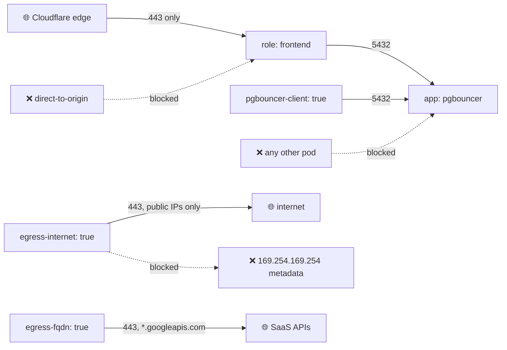

# Kubernetes NetworkPolicy — Zero-Trust Patterns

[](https://github.com/alice101-dev/k8s-networkpolicy-zero-trust/actions/workflows/ci.yml)

A production namespace that trusts **nothing by default**. Every pod starts
fully isolated (ingress + egress); each policy then grants one narrow,
label-scoped capability. Built entirely on **GKE Dataplane V2** — standard
`NetworkPolicy` for L3/L4 plus GKE-native **FQDN network policies**
(`FQDNNetworkPolicy`) for domain-based egress. No extra CNI, no Calico, no
open-source Cilium CRDs.



## How it composes

NetworkPolicies are **additive**: traffic flows if *any* policy allows it.
So the namespace ships one deny-all baseline, and every other file is a
single deliberate exception — reviewable in isolation, applied in order:

| # | File | Grants |
| --- | --- | --- |
| 00 | `default-deny-all.yaml` | nothing — isolates every pod, both directions |
| 01 | `allow-dns.yaml` | DNS to kube-dns only, UDP **and TCP** 53 |
| 10 | `frontend-ingress-cloudflare-only.yaml` | frontend reachable exclusively via Cloudflare ranges + GCLB health checks, port 443 — direct-to-origin bypass is dropped |
| 11 | `pgbouncer-ingress-from-clients.yaml` | Postgres pooler reachable only by pods labelled `pgbouncer-client: "true"`, port 5432 — the pooler fronts the database for everything, making it the #1 lateral-movement target ([companion deployment](https://github.com/alice101-dev/gke-pgbouncer-hardened)) |
| 12 | `egress-public-internet-https.yaml` | opt-in HTTPS egress to **public** IPs only — RFC1918 and the cloud metadata endpoint stay blocked |
| 20 | `gke-fqdn-egress-allowlist.yaml` | opt-in egress by **domain name** (GKE `FQDNNetworkPolicy`) for SaaS APIs whose IPs rotate daily — requires `--enable-fqdn-network-policy` on the cluster |

## The label contract

Nothing is granted namespace-wide. A workload gets connectivity by carrying
a label — a deliberate, reviewable act in its own manifest:

| Label on the pod | Unlocks |
| --- | --- |
| `role: frontend` | may receive traffic from Cloudflare |
| `pgbouncer-client: "true"` | may open connections to the DB pooler |
| `egress-internet: "true"` | may call the public internet on 443 |
| `egress-fqdn: "true"` | may call allowlisted domains (GKE FQDN network policy) |

A brand-new pod with none of these labels can resolve DNS — and do nothing
else.

## Production pitfalls these patterns close

- **Implicit `policyTypes`.** Omit it and Kubernetes infers isolation from
  which rule sections exist — an "egress-only" policy can silently start
  denying all ingress. Every policy here declares it explicitly.
- **UDP-only DNS rules.** Responses over 512 bytes retry over TCP 53;
  allow both, or debug intermittent resolution failures at 3 a.m.
- **`namespaceSelector: {}` as an "allow internal" catch-all.** That matches
  every namespace on every port — an allowlist in name only.
- **`0.0.0.0/0` egress without `except`.** "Allow internet" otherwise also
  matches every private/cluster IP **and** `169.254.169.254` — the classic
  SSRF path to node credentials.
- **Database ports exposed beyond their clients.** The pooler accepts 5432
  from labelled clients; no metrics sidecar, admin console, or debug port
  rides along, and nothing database-shaped ever faces the internet.
- **Duplicate `metadata.name` across files.** Same-named policies overwrite
  each other on apply; each policy here is named for the one thing it allows.

## Deploy & verify

```bash
kubectl apply -f .   # numeric prefixes double as apply order

# Inspect what isolation applies
kubectl describe networkpolicy -n production

# Negative test: an unlabelled pod must NOT reach the pooler
kubectl run probe --rm -it --image=busybox -n production -- nc -zv -w 3 pgbouncer 5432
# ... timeout = default-deny is doing its job

# Positive test: a labelled pod gets through
kubectl run probe --rm -it --image=busybox -n production \
  --labels='pgbouncer-client=true' -- nc -zv -w 3 pgbouncer 5432
```

## Testing & security scanning

Every push and pull request runs through [GitHub Actions](.github/workflows/ci.yml):

```bash
kubeconform -strict -summary -ignore-missing-schemas ./*.yaml   # schema validation (FQDNNetworkPolicy is a CRD)
checkov -d . --framework kubernetes                             # static analysis
```

## References

- [Kubernetes: Network Policies](https://kubernetes.io/docs/concepts/services-networking/network-policies/)
- [GKE Dataplane V2](https://cloud.google.com/kubernetes-engine/docs/concepts/dataplane-v2)
- [GKE: FQDN network policies](https://cloud.google.com/kubernetes-engine/docs/how-to/fqdn-network-policies)
- [Cloudflare IP ranges](https://www.cloudflare.com/ips/)
